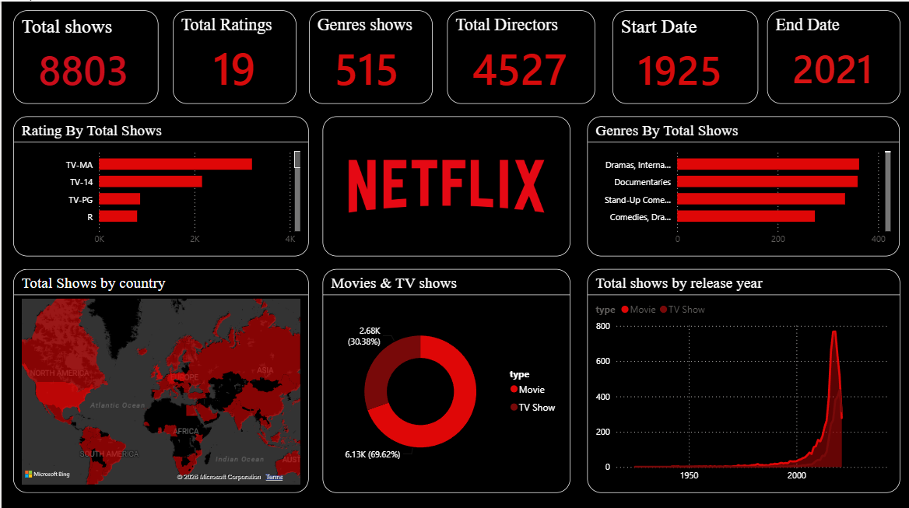

## Netflix Data Analytics Project

## Objective
Analyze Netflix content trends using Python, SQL, and Power BI.

## Tools Used
Python
Pandas
NumPy
Matplotlib
Seaborn
SQL
Power BI

## Workflow
Data Cleaning
Exploratory Data Analysis
SQL Analysis
Dashboard Creation
Business Recommendations

## Key Insights
Movies dominate Netflix catalog
Most content falls between 80–120 minutes
Content growth increased after 2015

Project Structure
data/
notebooks/
powerbi/
images/

## Power BI Dashboard

Power BI dashboard file:

powerbi/netflix.pbix

Dashboard Preview:



## How to Run

pip install -r requirements.txt

Save both files.


## Project Structure

```text
Netflix-Data-Analytics-Project/
├── data/
├── notebooks/
├── powerbi/
├── images/
├── requirements.txt
└── README.md
```
